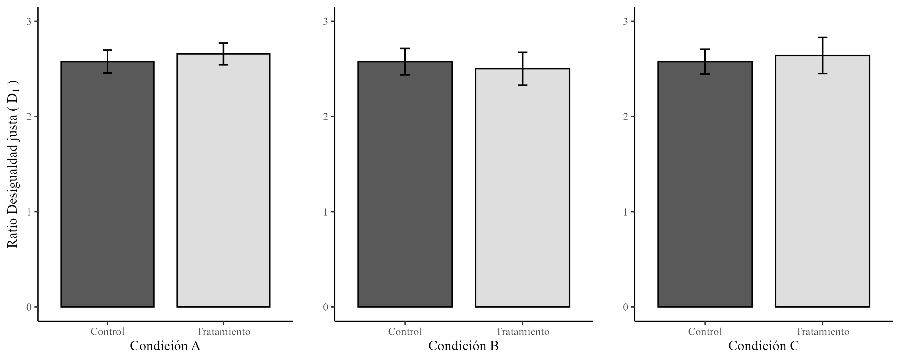
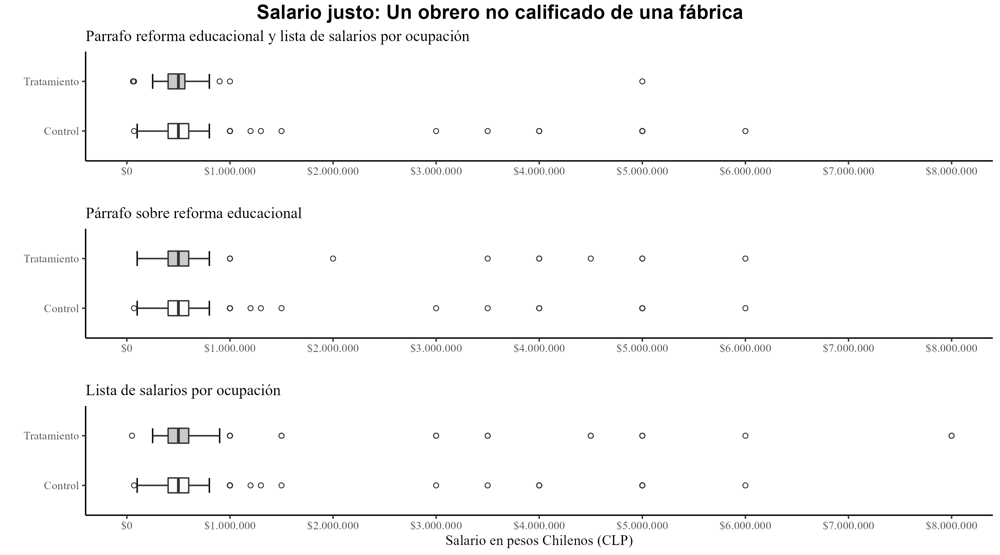

---
author:
- Julio Iturra Sanhueza^[Centro de Estudios de Conflicto y Cohesión social, [julioiturrasanhueza@gmail.com]()]
- Juan Carlos Castillo
- Catalina Rufs
- Luis Maldonado
bibliography: "C:/Users/Julio/Dropbox/Bibtex/zlibrary.bib"
csl: 'input/bib/apa6.csl'
title: "Percepción de desigualdad económica y su influencia sobre la justificación de las diferencias de ingreso legítimas"
output:
    bookdown::html_document2:
        number_sections: true
    bookdown::pdf_document2:
        template: default
        toc: false
    bookdown::word_document2:
        reference_docx: input/template.docx
        number_sections: false
css: input/css/custom.css         
header-includes:
  - \usepackage[spanish,es-tabla]{babel}
  - \usepackage{times}           # Times New Roman
  - \usepackage{caption}
  - \captionsetup[figure, table]{labelfont={bf},labelformat={default},labelsep=period}
  - \usepackage{graphicx}
  - \usepackage{float}
  - \usepackage{booktabs}
  - \usepackage{longtable}
  - \usepackage{array}
  - \usepackage{multirow}
  - \usepackage{wrapfig}
  - \usepackage{float}
  - \usepackage{colortbl}
  - \usepackage{pdflscape}
  - \usepackage{tabu}
  - \usepackage{threeparttable}
editor_options:
  chunk_output_type: console
abstract: "Este estudio analiza el efecto de la información factual sobre desigualdad económica en la justificación de desigualdad económica. Se implementó un diseño de carácter experimental a través de encuestas en una muestra representativa del área metropolitana de Santiago de Chile (n=732), con el objetivo de replicar los resultados reportados por Kriss-Stella Trump (2017) para el contexto de Suecia y Estados Unidos en torno a la justificación de brechas salariales globales. Nuestros resultados muestran que la información sobre salarios reales no impacta la justificación de brechas salariales globales. No obstante, se evidenció que la información sobre desigualdad salarial incrementa la justificación de brechas salarial según ocupaciones de alto y bajo estatus, lo cual es potenciado por la exposición conjunta a la condición que busca motivar la justificación del sistema social."
---


```{r include=FALSE}
library(texreg)
library(captioner)
library(knitr)
library(estimatr)
```

```{r setup, include=FALSE}
knitr::opts_chunk$set(warning = FALSE,message = FALSE, cache = FALSE,out.width = '85%',fig.pos= "H")
knitr::opts_knit$set(root.dir = NULL) #relative path for chunks within .rmd files
options(scipen=999)
rm(list=ls())
options(knitr.kable.NA = '')
options(knitr.graphics.error = FALSE)
Sys.setlocale("LC_ALL", "ES_ES.UTF-8")


is_word_output <- function(fmt = knitr:::pandoc_to()) {
  length(fmt) == 1 && fmt == "docx"
}
# Determine the output format of the document
outputFormat   = knitr::opts_knit$get("rmarkdown.pandoc.to")
```

```{r eval=FALSE, echo=FALSE}
rmarkdown::render("paper.Rmd", output_format = "bookdown::pdf_document2")
rmarkdown::render("paper.Rmd", output_format = "bookdown::html_document2")
rmarkdown::render("paper.Rmd", output_format = "bookdown::word_document2")
```

# Introducción

La desigualdad económica y sus consecuencias tanto políticas como sociales se han vuelto un tema de creciente relevancia [@Esping_Andersen2007; @piketty_Capital_2014]. Aún cuando esta tendencia ha sido explicada principalmente por cambios en los estratos superiores de la distribución de ingresos, recientes investigaciones han puesto su atención en las consecuencias de la concentración de la riqueza sobre las actitudes de la ciudadanía hacia la desigualdad económica. Al respecto, los estudios empíricos en el ámbito de la desigualdad subjetiva han puesto su atención en cómo la posición que detentan los individuos en la estructura social ejerce influencia en sus percepciones y juicios sobre la distribución de bienes en la sociedad [@Kluegel-Smith1986; @KluegelSmithWegener1995; @Janmaat2013]. En este ámbito, una de las temáticas abordadas han sido la percepción y justificación de brechas salariales entre distintos grupos de estatus [@Kelley1993; @Osberg2006].

En lo que respecta a características del contexto chileno para esta investigación, es relevante mencionar que en las últimas décadas Chile ha experimentado una fuerte disminución de la pobreza estructural como también un incremento de la escolarización promedio de la población principalmente a través a la expansión de la educación superior [@PNUD2015]. No obstante, otra característica de la estructura social chilena ha sido la persistente desigualdad en la distribución de ingresos, en conjunto de una ralentización en la movilidad social [@Rodriguez2018; @OECD2018], además de ser percibida como una sociedad donde el género, etnia y origen socioeconómico son factores clave en la cristalización de la desigualdad social [@pnud2017-desiguales]. En este contexto, estudios sobre la relación entre percepción y justificación de brechas salariales  [@Castillo2011; @Castillo2012a_justice] han dado cuenta de una disminución de la brecha percibida y justa, pero con una persistente asociación entre ambas en el tiempo [@Castillo-etal-2019].

Desde un modelo de interés racional [@Meltzer1981] se esperaría una menor justificación de brechas salariales en contextos de mayor desigualdad. Sin embargo, la literatura señala que para dar cuenta de la justificación de la desigualdad sería más relevante la percepción de desigualdad que la desigualdad objetiva [@Schroder2017_soc_jus; @Castillo2012b_multidimentional; @Wegener1987; @Wegener1990].

Las disposiciones ideológicas o "valores" son un aspecto clave para comprender las actitudes hacia la desigualdad [@Kulin2013; @Azaretal2018; @Maldonadoetal2019], donde tanto la percepción como la justificación de desigualdad estarían asociadas positivamente con disposiciones más igualitarias, mientras que individuos que adscriben a principios individualistas o agenciales son quienes menor desigualdad perciben y mayor tolerancia presentan frente a ésta [@Castillo2011; @Castillo2018]. Por otro lado, la evidencia experimental ha sugerido que la información factual sobre desigualdad económica tiene un rol clave en cómo toman forma las actitudes de los individuos [@Cruces2011; @mccall2017exposure; @becker_Mind_2019]. No obstante, esta evidencia se ha enfocado en preferencias individuales hacia la redistribución, prestando menor atención a actitudes relacionadas con la desigual distribución de los salarios según ocupaciones en el mercado laboral [@Ridgeway2014; @Treiman2013].

En el contexto de los estudios sociológicos sobre brechas salariales subjetivas, las investigaciones han evidenciado que la percepción de desigualdad cumple una función de punto de referencia o _ancla_ respecto a las evaluaciones de justicia salarial [@Castillo2012a_justice; @Wegener1987]. Esto quiere decir que al momento de proponer un salario justo para una ocupación, el referente cognitivo o ancla principal corresponde a cuanto se cree o percibe que esa ocupación obtiene como salario. En otras palabras, lo justo es una cantidad que puede ser menor, mayor o igual a lo percibido, pero el punto de referencia siempre es lo percibido. No obstante, la mayor parte de los estudios de corte transversal poseen limitantes para determinar empíricamente el efecto de la información factual en la justificación de diferencias salariales.

En este contexto, la presente investigación se propone responder a *¿Cuál es la influencia de la información sobre desigualdad económica en la justificación de brechas salariales?*. Para responder a esta pregunta,  la presente investigación busca replicar el estudio de Kriss-Stella @Trump2017, quien pesquisó el efecto de la información factual sobre desigualdad económica en la brecha salarial justa en Suecia y Estados Unidos.. Para ello, diseñamos y aplicamos experimentos en encuestas a adultos residentes de Santiago de Chile (sectores urbanos de la Región Metropolitana) en el 2014. En línea con una hipótesis de legitimación, los resultados sugieren que la información sobre desigualdad económica real tiene un efecto positivo en la justificación de brechas salariales. Es decir, las personas en general tienden a percibir menor desigualdad económica que la real, percepción que al ser actualizada con información objetiva impactaría en la justificación de mayores brechas salariales, dado que se incrementa el punto de referencia (percepción) para la evaluación de salarios justos.

## Estudio de la desigualdad salarial percibida y justa

Desde la sociología, el estudio de la desigualdad económica desde un punto de vista subjetivo ha desarrollado una vertiente de investigación empírica con un foco en los factores contextuales e individuales que explican la percepción de desigualdad, y a su vez, de qué manera éstos contribuyen a la justificación del sistema de estratificación social [@Smith1981]. Desde esta perspectiva se ha puesto atención a las denominadas "brechas salariales" como una manera de abordar empíricamente de qué manera los individuos perciben y justifican las diferencias salariales entre ocupaciones de distinto estatus [@Jasso1999]. Dicho lo anterior, nos disponemos a presentar brevemente cuáles son los principales hallazgos de la literatura empírica en torno a la relación entre percepción y justificación de desigualdad en perspectiva comparada, como también evidencia previa para el contexto chileno.

Por un lado, la evidencia empírica en torno al estudio subjetivo de las brechas salariales ha demostrado persistentemente que incrementos en la magnitud de la brecha salarial percibida vienen acompañados de mayores niveles de tolerancia a dichas diferencias [@kelley_Legitimation_1993; @Osberg2006; @Schroder2017_soc_jus]. Al respecto, la literatura ha señalado como factores explicativos de la justificación de desigualdad, por un lado, a la posición objetiva de los individuos en la estructura social, generalmente representada por el nivel de ingresos, logro educacional y características ocupacionales, y por el otro, a las experiencias subjetivas que devienen de dicha posición objetiva. En menor medida, se ha abordado la influencia contextual sobre dichas opiniones[@Kluegel-Smith1986 ]. En este contexto, se ha observado cierto consenso respecto al monto del salario considerado justo para ocupaciones de bajo estatus, mientras que para las ocupaciones de alto estatus, tales como gerentes o médicos se aprecia una alta variabilidad en las respuestas [@Kelley1993; @Osberg2006]. Estudios posteriores han sugerido que la influencia de la percepción sobre la justificación o tolerancia a la desigualdad puede explicarse por cambios normativos en la sociedad producto de transformaciones estructurales en el sistema económico y social de los países, argumentando que la transición hacia sociedades donde el mercado, en contraposición al Estado, toma mayor relevancia en la asignación de salarios según la ocupación que se detenta [@Aalberg2003; @Kelley-Zagorski2004].

En la línea del apartado anterior, diversos estudios han buscado responder a la interrogante respecto a cómo diferencias contextuales en la estructura económica y social pueden influenciar, por un lado, la percepción de desigualdad, y consecuentemente, la justificación de la desigualdad económica. Al respecto, esta perspectiva *macro*asume que las condiciones de cada sociedad pueden explicar las variaciones entre países con respecto a las apreciaciones subjetivas de la desigualdad. En este sentido, desde esta aproximación es clave entender que las características de las sociedades no son un mero agregado de las condiciones *micro*, sino que son genuinos factores contextuales irreductibles a nivel individual [@Janmaat2013, p.17]. En este sentido @Trump2017 argumenta que la comparación entre países contribuye a evidenciar la fortaleza de un mecanismo a las influencias del contexto, en su caso, evidenció que el efecto del tratamiento sobre desigualdad salarial se sostiene en contextos con distintos niveles de desigualdad estructural y regímenes de bienestar diferentes, tales como son Suecia y Estados Unidos.

Por un lado, a nivel macro se ha evidenciado una asociación positiva entre la desigualdad económica actual con la percepción y justificación de brechas salariales. Al respecto, empleando datos comparados para el año 1992, @Aalberg2003 da cuenta que en sociedades escandinavas como Noruega o Suecia, las diferencias percibidas y justas entre ocupaciones de bajo y alto estatus son mucho más bajas que en sociedades con mayores niveles de desigualdad como son Estados Unidos o Gran Bretaña (p. 147). En la misma línea, @Osberg2006 analizaron la asociación entre desigualdad percibida y justa para el caso Estados Unidos en perspectiva comparada, evidenciando que la opinión respecto a la brecha salarial percibida y justa tiende a ser más cohesionada en sociedades con menores niveles de desigualdad económica, mientras que para el caso estadounidense han tendido a polarizarse a lo largo del tiempo. En este sentido, la evidencia ha sido principalmente de carácter descriptivo, con ciertas excepciones en el ámbito comparado que han abordado empíricamente el efecto contextual de la desigualdad económica sobre la percepción y justificación de brechas salariales [@Hadler2005-paydiff; @Castillo2012b_multidimentional].

Respecto al punto anterior,  las características estructurales (como el nivel de riqueza y desigualdad económica de los países) están presentes en las diversas investigaciones sobre brechas salariales subjetivas. No obstante, en escasas ocasiones se han puesto a prueba esta hipótesis de manera directa en el análisis empírico,  [@Kelley-Zagorski2004; @Gijberts2020-legit-socialist]. Al respecto @Hadler2005-paydiff en su análisis comparado de 30 países, evidenció un efecto poco sustancial de la desigualdad sobre la opinión de los individuos respecto a la magnitud de las diferencias de ingresos percibidas en su sociedad. Posteriormente en el trabajo de @Castillo2012b_multidimentional se abordó el fenómeno de la justificación de desigualdad salarial desde una óptica *multidimensional*, pesquisando la relación entre desigualdad objetiva y brechas salariales subjetivas en contexto comparado usando datos del módulo de desigualdad de ISSP para el año 1999. Consistente con la evidencia previa, individuos que detentan posiciones de mayor estatus social perciben mayor desigualdad y a su vez son quienes presentan mayores niveles de tolerancia a la desigualdad salarial. Adicionalmente, se evidencia que en países con mayores niveles de desigualdad económica las brechas salariales consideradas justas son sustantivamente más altas que en contextos más igualitarios.

En una impronta similar, @Schroder2017_soc_jus analizó longitudinalmente cómo los cambios en la desigualdad económica se relacionan con los niveles de tolerancia a la desigualdad, y a su vez, de qué manera dichas preferencias pueden afectar los cambios futuros en la distribución del ingreso debido a las presiones redistributivas de los ciudadanos en contextos más desiguales. Sus resultados muestran que la desigualdad económica tiene un efecto positivo y persistente en los 3 a 4 años siguientes, lo cual contribuye con evidencia robusta respecto a la relación *macro-micro* entre desigualdad económica y la justificación de desigualdad económica. Sin embargo, sus resultados no respaldan la relación *micro-macro* entre tolerancia a la desigualdad y la distribución del ingreso futuro en el país. En términos sustantivos, la evidencia comparada contribuye empíricamente a respaldar la hipótesis de legitimación la cual sostiene que la justificación de desigualdad se relaciona estrechamente con la percepción respecto a la actual distribución del ingreso, la cual a su vez incrementa en contextos con mayor desigualdad.

<!--
## Evidencia experimental
--->
El estudio de las brechas salariales subjetivas ha sido escasamente abordado desde una perspectiva experimental. En este sentido, el estudio realizado por @Trump2017 ha demostrado de forma robusta que la información sobre la desigualdad salarial tiene un efecto positivo sobre la brecha justa, entendido como un efecto legitimador de las diferencias de ingresos para las distintas ocupaciones . En esta línea,  otro estudio experimental ha demostrado que individuos de bajo estatus expuestos a situaciones  que enaltecen el ideal meritocrático tienden a justificar en mayor medida la discriminación por parte de individuos con alto estatus, lo cual está motivado por atribuciones internas (individuales); y por otro lado, esto trae consigo una mayor justificación de la jerarquía de estatus, lo que es particularmente saliente en mujeres [@McCoy2007].


En un estudio experimental en Estados Unidos, @laurin_Stability_2013 dan cuenta que un sistema social que se percibe más estable y estático contribuye a que los individuos detentan visiones más conservadoras de la sociedad, lo cual conduce a una mayor legitimidad de las desigualdades sociales en general. Por otro lado, @trump_Does_2018 abordan empíricamente en qué medida la percepción de desigualdad motiva una mayor justificación del sistema social, evidenciando que la información sobre desigualdad no tiene un efecto sobre el apoyo global al sistema. No obstante, sus resultados muestran que la exposición a dicha información tiene un efecto negativo sobre la justificación del sistema económico.


En el ámbito de las actitudes hacia la redistribución económica, estudios como los de @Cruces2011 y @karadja_Richer_2017 han puesto su atención en el rol de la percepción de desigualdad y las implicancias que tiene la información factual en individuos que detentan percepciones sesgadas respecto de la distribución del ingreso, evidenciado que la corrección de dicho sesgo tiene un efecto positivo sobre las actitudes hacia la redistribución en individuos que subestiman la desigualdad y que a su vez subestimaban su posición en la distribución del ingreso. En un estudio similar, @becker_Mind_2019 analizó el rol de la corrección del sesgo en la brecha salarial de distintos grupos de estatus el acuerdo hacía mayor redistribución, evidenciando un efecto positivo en individuos que subestimaban la desigualdad previa al tratamiento, lo cual es particularmente pronunciado en la población no blanca y mujeres@kuziemko_How_2015 muestran que la información sobre desigualdad tiene un efecto nulo sobre las actitudes de los estadounidenses en ámbitos como el aumento de los impuestos, el salario mínimo o el acceso a alimentos; no obstante encontraron un efecto significativo sobre el incremento del impuesto al patrimonio y límite a la herencia como formas de reproducción de la desigualdad económica. @heiserman_Judgments_2020 realizaron una serie de experimentos donde se analizó el efecto de la información en torno a la desigualdad en Estados Unidos sobre la percepción de desigualdad y la actitud hacia justicia económica. Los autores evidenciaron un incremento de la percepción de desigualdad general en quienes fueron expuestos al tratamiento, como también un efecto negativo sobre la evaluación sobre la justicia económica. Adicionalmente, los autores evidenciaron un nulo efecto sobre medidas mitigadoras como la intervención del Estado o la reducción de la desigualdad en general.  

<!--
## Evidencia para el caso de Chile
--->

El estudio empírico de la desigualdad subjetiva en Chile es un área que desarrollo creciente en  este país. Al respecto, el informe elaborado por el @pnud2017-desiguales ha demostrado que la desigualdad social se ha transformado en un tópico de preocupación pública en los últimos años, particularmente en torno a distribución de oportunidades y sus consecuencias en la distribución del ingreso.

En el ámbito de estudio de las brechas salariales subjetivas, ha sido posible evidenciar que durante el año 1999 y 2009 la percepción de los salarios según distintas ocupaciones ha ido incrementando y junto con ello la brecha salarial percibida [@Castillo2012contrastes]. Al respecto, se ha evidenciado que la percepción de desigualdad se encuentra influenciada positivamente por el estatus del individuo [@Castillo2012_medicion], como también por factores ideológicos tales como mayor adscripción hacia valores como el igualitarismo [@Castillo2009-brecha-justa; @Castillo2011]. En este sentido, se ha constatado que la brecha salarial percibida puede ser concebida como el punto de referencia para la realización de evaluaciones de justicia salarial, a pesar de que individuos de mayor nivel educacional declaran percibir mayor desigualdad, se ha evidenciado que su asociación con la brecha salarial justa se mantiene relativamente constante entre los grupos de estatus [@Castillo2012a_justice].

En un estudio reciente, @Castillo-etal-2019 analizaron la evolución del salario percibido y justo en los últimos 20 años para un obrero no calificado de una fábrica y para un gerente de una empresa nacional, evidenciando un incremento tanto en la percepción como en la justificación del salario para ambas ocupaciones. Adicionalmente, los análisis de las brechas salariales subjetivas sugieren que la percepción de desigualdad salarial ha ido disminuyendo en los últimos años, siendo particularmente relevante en los estratos con educación terciaria técnica y universitaria, lo cual a su vez ha venido acompañado con una disminución en la brecha salarial justa respecto a las décadas anteriores.

## El estudio original

El presente estudio busca replicar la investigación realizada por @Trump2017, en donde la hipótesis central sostiene que individuos que obtienen información sobre que su sociedad es más desigual de lo que pensaban, tenderían a considerar mayores brechas de ingreso como legítimas. @Trump2017 llevó a cabo este estudio en Estados Unidos, por ser un contexto altamente desigual, y luego lo replicó en Suecia para evaluar la validez de los resultados en una sociedad más igualitaria. En nuestro caso, la motivación de aplicarlo en el contexto chileno radica en que, si bien Chile tiene una distribución de ingresos altamente desigual, existe una sostenida sub-percepción de esta desigualdad por parte de la población [@Castillo2009-brecha-justa; @Castillo-etal-2019].

El estudio original tenía como variable dependiente la brecha salarial considerada justa entre ocupaciones de distinto estatus. La evaluación empírica de este concepto se elaboró en base al set de preguntas del módulo de desigualdad social de la _International Social Survey Programme_ (en adelante, ISSP), donde se pregunta a las personas cuánto *creen que ganan* al año una serie de ocupaciones, para luego preguntar cuánto creen que *deberían ganar*. Al dividir los montos entre ocupaciones de alto y bajo estatus se obtiene una magnitud que se interpreta como una brecha, tanto para el caso de la desigualdad percibida (preguntas de "cuánto creen que ganan") como para la desigualdad justa ("cuánto creen que deberían ganar").

La muestra del experimento original de @Trump2017 para Estados Unidos fue reclutada empleando *Amazon Mechanical Turk* alcanzando un total de 407 participantes, quienes fueron asignados aleatoriamente a dos grupos; 203 formaron parte del grupo de control y 204 del grupo de tratamiento. La condición de tratamiento consistió en otorgar información factual sobre el salario de cinco ocupaciones en Estados Unidos. Previo a la asignación aleatoria, se preguntó *cuánto ganan* actualmente un grupo de ocupaciones de distinto estatus, esto con el objetivo de controlar por la percepción de desigualdad previa. Luego de la exposición al tratamiento, se realizó la pregunta sobre cuánto deberían ganar cada una de las ocupaciones. Los participantes en grupo de control respondieron las preguntas sobre ingreso percibido y justo sin ser expuestos a la información sobre salarios reales. Finalmente, se recopiló información sociodemográfica como también de otros indicadores relacionados a ámbitos tradicionales de opinión pública y actitudes hacia la desigualdad. Dado que un 93% de los participantes reportaban una subestimación de la desigualdad percibida respecto a la real, el tratamiento permitió explorar si la exposición a información producía un ajuste que tuviese como resultado un incremento en la desigualdad recomendada. Los resultados dan cuenta que el grupo tratado, respecto al grupo de control, tuvo un incremento promedio de un 50% en la desigualdad recomendada. En una segunda parte del estudio, se replicó el diseño del estudio en Suecia en una muestra de 250 participantes. Los resultados obtenidos van en la misma línea, es decir, se evidenció que el grupo expuesto a información, respecto al grupo de control, obtuvo un incremento promedio de un 20% en la brecha salarial recomendada.

En la sección final del estudio, @Trump2017 manipuló la motivación de justificación del sistema para determinar su efecto sobre la brecha salarial justa, además de analizar si dicha motivación modera el efecto de la condición de desigualdad. El tratamiento corresponde a un párrafo de texto que manipula las percepciones en torno a lo ineludible del sistema social, en el cual se describe a los participantes que en el futuro será cada vez más difícil emigrar de su país. Por un lado, los resultados sugieren que la manipulación de justificación del sistema incrementa la brecha salarial recomendada. Adicionalmente, se evidencia que el incremento en la justificación de desigualdad reportada en los estudios anteriores se ve incrementada al ser combinada con la condición de justificación del sistema.

## Hipótesis {.unnumbered}

En línea con el apartado anterior, nos disponemos a presentar nuestras hipótesis centrales. En primer lugar, la literatura en torno a la relación entre percepción y justificación de desigualdad ofrece evidencia para sostener que:

> $H_{1}$: La información sobre desigualdad salarial entre ocupaciones de distinto estatus contribuye a una mayor justificación de desigualdad salarial.

Adicionalmente, utilizamos una condición que busca manipular lo que @Trump2017 denomina motivación hacia la justificación del sistema. En este sentido, se ha evidenciado que en sistemas que son percibidos más estables y menos proclives al cambio, los individuos tienden a justificar el _status quo_ debido a la percepción de que sus acciones tienen nulo impacto en el devenir de sus sociedades, teniendo como consecuencia que sociedades más estables producen mayor legitimación de las desigualdades sociales[@laurin_Stability_2013]. En este estudio, se presenta un párrafo que aborda las consecuencias a largo plazo de la reforma educacional llevada a cabo por el gobierno de turno, esto con el objetivo de contextualizar al participante respecto a que su capacidad de agencia tiene limitada influencia sobre los procesos descritos en el texto. En la sección de métodos se describe en mayor detalle la manipulación experimental. Finalmente, considerando el argumento anterior, sostenemos que:

> $H_{2a}$: La exposición al párrafo sobre las consecuencias futuras de la reforma educacional motivará un incremento en la justificación de desigualdad salarial.

Finalmente, el estudio original evidenció que la manipulación de la motivación hacia la justificación del sistema trae consigo que los individuos que son expuestos a información sobre desigualdad, pueden incluso considerarla más legítima cuando perciben que poseen poco control sobre las consecuencias que devienen del sistema social. En esta línea afirmamos que:


> $H_{2b}$:  La exposición conjunta a la condición de información sobre desigualdad salarial y al párrafo sobre las consecuencias futuras de la reforma educacional reforzará la justificación de desigualdad salarial.

# Metodología

## Datos

Nuestros datos provienen del estudio "Creencias políticas y sociales", el cual tuvo lugar entre noviembre y diciembre del año 2014. La encuesta se aplicó a individuos adultos con edad entre 18 y 87 años de sectores urbanos de la Región Metropolitana en Chile obteniendo una muestra final de 732 casos que cumplen con los criterios de validación (ver Anexo Figura \@ref(fig:flujo)). El método de administración del cuestionario fue de manera presencial y asistido por computadora (CAPI). La media de edad de los participantes es de 44 años, 62% son mujeres, 18% tiene educación terciaria o superior; y un 54% declara no tener posición política.

A lo largo del cuestionario se incluyen preguntas sobre distintos temas políticos y sociales, incluyendo módulos presentes en otros estudios sobre actitudes hacia la desigualdad y opinión pública. En la sección final se incluyen un módulo para la caracterización sociodemográfica de los individuos que conforman la muestra.

## Variable dependiente: Brecha salarial justa

Al igual que @Trump2017, la variable dependiente central es la brecha salarial *recomendada* o justa. Lo que se busca conocer es la opinión con respecto a qué tan grandes deberían ser estas diferencias entre ocupaciones de distinto estatus. Para realizar la medición de esta actitud, decidimos emplear las preguntas que ha utilizado previamente en Chile el módulo *Social Inequality* del *International Social Survey Programme*. En primera inctancia se les pregunta a las personas encuestadas cuánto dinero creen que *gana* una lista de ocupaciones en un año, después se les pregunta cuánto creen que estas ocupaciones *deberían* ganar en un año, siendo estas preguntas las utilizadas para construir la brecha salarial justa. Con esto es posible conocer el nivel de desigualdad *percibida* por los individuos, como también conocer el nivel de desigualdad que *recomiendan* o que consideran justa. La principal diferencia es que en este estudio se pregunta por el ingreso mensual de cada ocupación.

Las ocupaciones que se presentaron son "Un profesor de educación básica", "Un ministro de Gobierno chileno", Un obrero no calificado de una fábrica, Un dueño de una pequeña empresa, "Un gerente de una gran empresa" y "Un doctor o médico de medicina general". El orden en el que se posicionaron las ocupaciones se realizó de manera aleatoria. La operacionalización de la variable dependiente se realizó a través del Índice de justicia [@Jasso1999]. Esta medida permite conocer la desigualdad percibida y recomendada a través la función $\ln(\text{Ocupación alto estatus} / \text{Ocupación bajo estatus})$. Un número más alto, indica una mayor brecha entre el salario de la ocupación de alto estatus  y la de estatus bajo.

Dicho lo anterior, empleamos dos medidas basadas en el índice de justicia. La ecuación \@ref(eq:des1) representa la medida original empleada por @Trump2017, donde no se consideran las ocupaciones específicas, razón por la cual se utiliza el salario máximo y mínimo mencionado por el entrevistado. Esto se debe a que el interés principal es conocer la desigualdad, tanto percibida como recomendada, desde un punto de vista global.


```{=tex}
\begin{equation}
D_1 = \ln\Bigg(\frac{\text{Máximo salario recomendado}}{\text{Mínimo salario recomendado}}\Bigg)
(\#eq:des1)
\end{equation}
```
Adicionalmente, calculamos el mismo índice en base al salario de la ocupación de mayor y menor estatus [@Jasso1999], media que ha sido empleadas anteriormente en estudios realizados en Chile [@Castillo2012a_justice; @Castillo2012_medicion] y que permite disponer de una aproximación adicional a la desigualdad percibida y al salario justo. Para el cálculo del índice, la ecuación \@ref(eq:des2) muestra que el salario de "Un gerente de una gran empresa" es la ocupación de mayor estatus y que el salario de "Un obrero no calificado de una fábrica" es la ocupación de menor estatus. 


```{=tex}
\begin{equation}
D_2= \ln\Bigg(\frac{\text{Salario Gerente}}{\text{Salario Obrero}}\Bigg)
(\#eq:des2)
\end{equation}
```


## Experimento

Al igual que en @Trump2017, el centro de nuestro estudio está en las preguntas sobre percepción de salarios, información sobre desigualdad y las preguntas sobre salario justo para cada ocupación. A diferencia del estudio original, nuestro diseño cuenta con tres condiciones experimentales y un grupo control.

Una parte de la muestra (226 participantes) corresponde al grupo control: estos no recibieron tratamiento de información, respondieron preguntas sociodemográficas, la escala de Creencia en un Mundo Justo (CMJ),[^1] seguido de las preguntas sobre desigualdad salarial percibida y justa. Adicionalmente, se emplearon 2 tratamientos en tres combinaciones distintas lo cual se resume en la Tabla \@ref(tab:tab-res).

El primer grupo (*n*=254) corresponde a la condición de información sobre los sueldos reales para cada una de las cinco ocupaciones en Chile  en el año 2011 (anexo Tabla \@ref(tab:tab-treat1)). El segundo grupo (*n*=148) obtiene un texto que describe las consecuencias de largo plazo que tendría la reforma educacional con respecto a generar condiciones de mayor equidad en el sistema educativo para las futuras generaciones (anexo Figura \@ref(fig:treat2)). Esta reforma educacional tuvo el objetivo de incorporar criterios de universalidad al sistema escolar chileno, el cual hasta ese momento permitía que ciertos establecimientos con proyectos educativos específicos pudiesen seleccionar a sus estudiantes en base a su rendimiento y capacidad de pago de sus familias, generando así mayor segregación socioeconómica en las escuelas y estratificando las oportunidades futuras de los estudiantes [@Bellei2015; @Bellei2008book]. De esta manera, a través de distintas iniciativas se apuntó a construir una institucionalidad que garantizara el acceso a la educación y la seguridad a las familias, a modernizar la profesión docente y a avanzar hacia una educación superior gratuita y de calidad [@mineduc_Mapa_2014]. El tercer grupo (*n*=104) combina la condición respecto a las consecuencias de la reforma educacional con la lista de salarios para las seis ocupaciones. La cuarta condición corresponde al grupo de control, el cual no recibe ninguna información.

A través de este diseño se buscó poner a prueba la hipótesis de ajuste mediante la actualización de la percepción de desigualdad de las personas tratadas a través de información factual sobre desigualdad, como también a través de la inducción de sentimientos justicia a través del párrafo sobre las consecuencias de la reforma educacional.

[^1]: En base a los criterios señalados por @Brown2008, se realizó un Análisis Factorial Confirmatorio que evidenció un buen ajuste de la escala para la Creencia en un Mundo Justo ($\chi^2(5)$=8.40, $p$=0.015, CFI=0.99, RMSEA=0.06). En base a esta evidencia, se procedió a crear un índice promedio con los ítems.


|                                | Condición A | Condición B | Condición C |
|--------------------------------|:-----------:|:-----------:|:-----------:|
| Párrafo reforma educacional    |     No      |     Sí      |     Sí      |
| Lista salarios según ocupación |     Sí      |     No      |     Sí      |
Table: `r as.character(paste("(\\#tab:tab-res)", "Resumen Condiciones de Tratamiento."))`


## Métodos

En primera instancia se realizaron análisis de regresión lineal para determinar el balance de la asignación aleatoria para cada tratamiento. Estos análisis nos permiten determinar si la asignación aleatoria a los grupos de tratamiento y control fue realizada adecuadamente según entre las distintas covariables de interés. Se incluyeron las covariables sexo, edad, escala promedio de Creencia en Mundo Justo, auto-posicionamiento en eje derecha-izquierda, nivel educacional y el logaritmo natural de la brecha salarial percibida (ver Tabla \@ref(tab:tab-balance) en anexos).

Para determinar el efecto del tratamiento empleamos modelos de regresión lineal para estimar el efecto causal promedio (ATE) a lo cual se incluyeron covariables para mejorar la eficiencia de las estimaciones [@gerber2008field; @hernan_Causal_2020]. Se estimaron modelos individuales para cada uno de los tratamientos empleando ambas mediciones de la brecha salarial justa descritas anteriormente. Cada modelo evaluó si la exposición al tratamiento de información (A, B o C) tuvo un efecto estadísticamente significativo en la desigualdad recomendada respecto al grupo de control.

# Resultados y discusión

En primer lugar, es relevante destacar que un 82% de los participantes percibe que la brecha entre el salario de las ocupaciones de mayor y de menor estatus es menor a la que realmente se puede determinar según los datos CASEN 2011. Esta información permite confirmar que al ser expuestos a la condición de información, se está generando un ajuste efectivo en términos de la percepción de desigualdad.

Los resultados generales del experimento son presentados en la Figura \@ref(fig:barplot1) para la desigualdad recomendada en base al máximo y mínimo salario mencionado. Así también, los resultados para la desigualdad recomendada en base al salario de las ocupaciones de alto y bajo estatus son presentados en la Figura \@ref(fig:barplot2).

A partir de la Figura \@ref(fig:barplot1), los resultados sugieren que al recibir el tratamiento de información sobre desigualdad, no existen diferencias estadísticamente significativas en términos de la desigualdad recomendada general ($D_1$) para el grupo tratamiento respecto al grupo control. Estos resultados sugieren que, contrario a las expectativas iniciales, individuos que son más conscientes de la desigualdad a nivel estructural no cambian sus preferencias en términos de el salario que consideran justo.

```{r barplot1, echo=FALSE, fig.cap = "Resultados del experimento, en base a los valores predichos para la desigualdad recomendada general.", fig.align='center'}

```

Conforme a lo anterior, se realizó el análisis posterior para determinar el efecto del tratamiento sobre la desigualdad recomendada en base al índice propuesto por @Jasso1999, considerando el salario recomendado para las ocupaciones de alto y bajo estatus.

Los resultados en la Tabla \@ref(tab:tab-model1) dan cuenta que la exposición a información sobre la desigualdad salarial según ocupación (Condición A) produce un cambio de 0,33 puntos en la desigualdad recomendada promedio, equivalente a un incremento de 20% respecto al grupo control ($p$\<0.001). Por otro lado, la exposición al tratamiento de información basado en el párrafo sobre la reforma educacional (Condición B) no afecta el nivel de desigualdad que prefieren los encuestados. Si bien existe un incremento de 0,23 en la desigualdad recomendada, el tratamiento no genera una diferencia estadísticamente significativa respecto al grupo control. Finalmente, se evidenció que la exposición conjunta de lista de salarios reales y el párrafo sobre consecuencias de la reforma educacional (Condición C) la desigualdad recomendada incrementó en 0,55 puntos. Esto en base a que el grupo que expuesto a ambas condiciones simultáneas recomienda 2,32 puntos promedio en contraste con 1,72 del grupo control ($p$\<0.001), lo cual representa un incremento aproximado de un 33% en la brecha salarial justa.

Estos resultados se explican principalmente por el incremento del salario recomendado para la ocupación de gerente, mientras que el salario del obrero se mantuvo en un promedio similar (Ver en Anexos Figura \@ref(fig:obgapb) y \@ref(fig:gergapb)), lo cual va en consonancia evidencia previa previos donde se ha documentado que la percepción de salarios generalmente varía con respecto a las ocupaciones de alto estatus, mientras que la estimaciones  respecto al salario de ocupaciones como la de un obrero tienden a aproximarse al salario real [@Castillo2012a_justice; @Castillo-etal-2019]

La evidencia ofrece evidencia a favor de la hipótesis que sostiene que manipular la percepción de desigualdad de las personas a través de información factual sobre los salarios de ocupaciones de distinto estatus se traduce en mayor justificación de desigualdad. Respecto del mecanismo que podría estar operando, @Trump2017 plantea que el cambio en las preferencias se genera a partir del sesgo de anclaje y de justificación racional. Por un lado, el sesgo de anclaje implica que los individuos ajustan sus preferencias respecto a la percepción. En este caso, la actualización respecto al salario real de la ocupación de alto estatus, genera que la persona justifique racionalmente que determinada ocupación obtenga dicho salario, lo cual se traduce en un incremento del promedio en la brecha salarial justa.

```{r barplot2, echo=FALSE, fig.cap = "Resultados del experimento, en base a los valores predichos para la desigualdad recomendada según ocupaciones de alto y bajo estatus.", fig.align='center'}
knitr::include_graphics('output/images/barplot2.png')
```

```{r tab-model1, echo=FALSE, results='asis'}
load("output/tables/modelos02.RData")
cap <- "Modelos de regresión para desigualdad recomendada."
custom.coef.names = c("Intercepto","Tratamiento","Creencia Mundo Justo",
                      "Centro (ref: Izquierda)", "Derecha", "Ninguno", "No sabe",
                      "Desigualdad percibida (Log)","Educación",
                      "Tratamiento","Tratamiento")
custom.note = " $^{***}$p < 0,001;$^{**}$p < 0,01;$^{*}$p < 0,05. Errores estándar robustos entre paréntesis (HC2)"

if (knitr::is_html_output()|is_word_output()){
texreg::htmlreg(l = list(e2cd04.so.r,logOGcov3.so.r,e1bd04.so.r,logOGcov2.so.r,e1ad04.so.r,logOGcov1.so.r),
        custom.coef.names = custom.coef.names,
        custom.model.names = c("Modelo 1","Modelo 2","Modelo 3","Modelo 4","Modelo 5","Modelo 6"),
        custom.header = list("Condición A"=1:2,"Condición B"=3:4,"Condición C"=5:6),
        digits = 3,center = TRUE,
        doctype = FALSE,
        reorder.coef = c(2:9, 1),
        caption = paste("(\\#tab:tab-model1)",cap),
        caption.above = T, include.rs = FALSE, include.rmse = FALSE,include.ci = FALSE,
        custom.note = custom.note)
}


if (knitr::is_latex_output()){
texreg::texreg(l = list(e2cd04.so.r,logOGcov3.so.r,e1bd04.so.r,logOGcov2.so.r,e1ad04.so.r,logOGcov1.so.r),
        custom.coef.names = custom.coef.names,
        custom.model.names = c("Modelo 1","Modelo 2","Modelo 3","Modelo 4","Modelo 5","Modelo 6"),
        custom.header = list("Condición A"=1:2,"Condición B"=3:4,"Condición C"=5:6),
        digits = 3,reorder.coef = c(2:9, 1),
        caption = paste("(\\#tab:tab-model1)",cap),
        center = TRUE,
        caption.above = T,scalebox = 0.8,
        float.pos = "H", booktabs = TRUE, use.packages = F, include.rs = FALSE, include.rmse = FALSE,include.ci = FALSE,
        custom.note = custom.note)
}
```

En la Tabla \@ref(tab:tab-model1) se presentan los resultados de los modelos para las tres condiciones de manera independiente e incluyendo los controles. Los resultados son robustos al incluir como controles la escala de Creencia en un Mundo justo (CMJ), posición política, nivel educacional y la brecha salarial percibida. Respecto de las covariables, a diferencia de los resultados reportados por @Trump2017, no existe asociación entre las creencias en un mundo justo y la brecha salarial justa, lo cual da cuenta que lo que las personas piensan respecto a la justicia global no se relaciona con la magnitud de desigualdad que recomiendan.

Desde un enfoque de interés racional, se esperaría que aquellas personas que mayor estatus justifican mayores niveles de desigualdad. En la Tabla \@ref(tab:tab-model1) podemos ver que el nivel educacional (proxy de nivel socioeconómico), muestra una asociación positiva y estadísticamente significativa ($p$<0,05) en el Modelo 1 y 2, pero una ausente relación en el Modelo 3 y 4, que incluyen el párrafo sobre la reforma educacional como condición. Al alero de un enfoque basado en la teoría de justificación del sistema, @Trump2017 argumenta que situaciones que parecen estar fuera del control de los individuos, motivan un incremento en el apoyo al funcionamiento del sistema. En el caso de nuestro estudio, las consecuencias a largo plazo de la reforma educacional parece no motivar un incremento en el apoyo al sistema para el caso chileno, incluso en tópicos altamente relevantes en la opinión pública como es la reforma educacional y el incremento de la equidad en el sistema.

Finalmente, los modelos 5 y 6 de la Tabla \@ref(tab:tab-model1) muestran que la condición que combina ambos tratamientos tiene un efecto promedio de 0.61 ($p$<0,001), equivalente a 0,58  desviaciones estándar respecto al grupo control (detalles en Tabla \@ref(tab:tab-modelz)). En este sentido, si bien la condición respecto a la reforma educacional no tiene un efecto  en la brecha salarial justa, cuando se incorpora conjuntamente a la información sobre los salarios reales observamos un incremento sustantivo en la justificación de desigualdad. En este caso la condición del párrafo de la reforma educacional no posee un efecto individual, sin embargo se genera un efecto aditivo en conjunto de la condición de salarios lo cual puede ser identificado como una interacción causal aditiva, donde uno de los tratamientos incrementa o interactúa con el efecto del otro, generando un efecto de mayor magnitud que un tratamiento individual [@keele_Causal_2020, p.4]. Una posible interpretación de este resultado es que al actualizar la información sobre salarios reales, los individuos que son expuestos al tratamiento de la reforma educacional son motivados a considerar mucho más justas dichas diferencias.

# Conclusiones

El presente trabajo ha evidenciado que la desigualdad recomendada se ve afectada por la percepción de desigualdad, específicamente cuando los individuos son conscientes de la brecha salarial real. En base a la hipótesis propuesta, se ha evidenciado que tener mayor información con respecto a la desigualdad económica tiene como consecuencia que los individuos recomienden una mayor brecha salarial entre ocupaciones de bajo y alto estatus. En este sentido, se emplearon dos tratamientos en tres combinaciones distintas, donde la información respecto a los salarios afecta sustantivamente la magnitud de desigualdad recomendada, mientras que obtener información con respecto a las consecuencias de largo plazo que tendría la reforma educacional no afecta significativamente la brecha salarial recomendada. Así también, se evidenció que la combinación de ambos tratamientos posee un efecto promedio más alto que cada condición de manera individual. En este punto, una de las limitantes de nuestro estudio es la imposibilidad de testear de qué manera la manipulación de la motivación hacia la justificación del sistema modera el efecto de la información de desigualdad salarial, de modo tal que sea posible generar una estrategia de identificación de un efecto causal heterogéneo [@keele_Causal_2020], dado que la asignación se realiza conjuntamente a un mismo grupo y no permite diferenciar entre ambas condiciones, por lo tanto no es factible estimar un efecto de interacción entre ambas condiciones como sí se realizó en el estudio original.

@Trump2017 evidenció que en contextos con diversos grados de desigualdad económica y diferencias sustantivas en el sistema de bienestar social, mayor información sobre la desigualdad económica incrementa la desigualdad que recomiendan los individuos. Nuestro estudio empleó dos medidas para abordar el análisis de la desigualdad recomendada. Por un lado, empleamos la medida que utilizó Trump para analizar la desigualdad general, donde no se evidenciaron efectos significativos de las tres condiciones. Por otro lado, decidimos emplear la medida propuesta por @Jasso1999 como alternativa a lo realizado por Trump, evidenciando que la información sobre desigualdad salarial tiene un efecto sustantivo en la desigualdad recomendada según ocupaciones de alto y bajo estatus.

En base a esta evidencia, es factible sostener que las percepciones relacionadas con la desigualdad, y en particular con la desigualdad salarial, posee consecuencias sustantivas en cómo los individuos racionalizan estas diferencias. Desde la literatura sobre preferencias redistributivas, se sostiene que contextos más desiguales se asocian con mayor demanda por redistribución. No obstante, aquí sostenemos que el efecto de la información es robusto sobre la brecha salarial recomendada, independiente de la posición política, estatus social y creencias distributivas.

Dicho lo anterior, nuestros resultados poseen implicancias en el estudio de las preferencias distributivas en contextos de alta desigualdad y con diversos sistemas de bienestar social, como ocurre en los países de América Latina. Así, se abre la interrogante con respecto a cuál sería la influencia de la desigualdad recomendada con las preferencias redistributivas, o sobre qué ámbitos de política social podría tener un impacto. Al respecto se ha evidenciado que el apoyo a distintas medidas redistributivas varía según el tópico en evaluación teniendo presente que la *necesidad* es distinta al ser *merecedor* [@Jensen2017; @Aaroe2014]. Esta racionalidad opera como diferenciador en el apoyo a políticas sociales en salud o pensiones de vejez, donde la magnitud de la desigualdad que se justifica es un antecedente relevante al momento de evaluar la asignación de recursos.

A diferencia de los experimentos en contextos cerrados y controlados, la realización de experimentos a través de encuestas ofrece la posibilidad de acceder a muestras de mayor tamaño y representatividad. Sin embargo, los resultados del presente estudio deben ser interpretados con cautela debido a que la muestra corresponde una parte del área urbana de la Región Metropolitana, lo cual imposibilita extrapolar los resultados a la sociedad chilena en su conjunto. Por otro lado, se requiere mayor investigación en términos de que no es posible evidenciar la sostenibilidad temporal del efecto del tratamiento, debido a que las actitudes no son estáticas, en particular aquellas que se relacionan con temas distributivos. Futuras investigaciones deben avanzar hacia un estudio con tamaños muestrales que permitan realizar inferencias que se hagan cargo de las desigualdades territoriales a nivel nacional. En esta línea, recientes avances en el ámbito de la investigación realizada a través de encuestas a través de internet sugieren que la realización experimentos usando esta estrategia de muestreo tiene la ventaja de ser altamente eficiente en el uso de recursos, además de que permite obtener muestras con niveles de heterogeneidad socioedemográfica y socioeconómica similares a encuestas tradicionales [@Zhang2018].

# Referencias

::: {#refs}
:::

<!-- Although <div> is an HTML tag, this method also works for other output formats such as PDF. -->

# (APPENDIX) Anexos {.unnumbered}

`r if (knitr::is_latex_output()){ '\\appendix'}` `r if (knitr::is_latex_output()){ '\\section{Anexos}'}`

```{r obgapb, echo=FALSE, fig.cap = "Comparación de la distribución de salario recomendado para un obrero no calificado de una fábrica según asignación del tratamiento.", fig.align='center',out.width='75%'}

```

```{r gergapb, echo=FALSE, fig.cap = "Comparación de la distribución de salario recomendado para un Gerente según asignación del tratamiento.", fig.align='center',out.width='75%'}
knitr::include_graphics('output/images/gergapb.png')
```

```{r tab-balance, echo=FALSE, results='asis'}
load("output/tables/balance-models01.RData")
coef <- c("(Intercepto)","Sexo (ref: Mujer)","Edad","Educación",
          "Creencia Mundo Justo",
          "Centro (ref: Izquierda)",
          "Derecha",
          "Ninguno","No sabe",
          "Desigualdad percibida (Log)")
cap <- "Balance de la asignación aleatoria al grupo tratamiento"
custom.note = "$^{***}$p < 0,001;$^{**}$p < 0,01;$^{*}$p < 0,05; Modelos excluyen outliers$^1$"

if (knitr::is_html_output()|is_word_output()){
texreg::htmlreg(l = list(bal3,bal2,bal1,bal3.so,bal2.so,bal1.so),
        custom.model.names = c("Cond. A", "Cond. B", "Cond. C","Cond. A$^1$", "Cond. B$^1$", "Cond. C$^1$"),
        custom.coef.names = coef,
        caption = paste("(\\#tab:tab-balance)",cap),
        caption.above = TRUE,
        doctype = F, custom.note = custom.note)
  }


if (knitr::is_latex_output()){
texreg::texreg(l = list(bal3,bal2,bal1,bal3.so,bal2.so,bal1.so),
       custom.model.names = c("Cond. A", "Cond. B", "Cond. C","Cond. A$^1$", "Cond. B$^1$", "Cond. C$^1$"),
       custom.coef.names = coef,
       caption = paste("(\\#tab:tab-balance)",cap),
       caption.above = TRUE,
       booktabs = TRUE,
       digits = 2,
       float.pos = "H",
       use.packages = F,
       include.rs = FALSE,
       include.rmse = FALSE, custom.note = custom.note)
  }
```

```{r tab-modelz, echo=FALSE, results='asis'}
load("output/tables/modelos_z.RData")

cap <- "Modelos de regresión para Desigualdad recomendada (estandarizada)"
custom.note = "Intervalos de confianza entre paréntesis calculados al 95\\% empleando errores estándar robustos (HC2)"

if (knitr::is_html_output()|is_word_output()){
texreg::htmlreg(
  list(logOGcov3c, logOGcov2b, logOGcov1a),
  custom.model.names = c("Modelo A", "Modelo B", "Modelo C"),
  custom.coef.names = custom.coef.names,
  caption = paste("(\\#tab:tab-modelz)",cap),
  caption.above = TRUE,
  reorder.coef = c(2:9, 1),
  booktabs = TRUE,
  digits = 2,
  leading.zero = TRUE,
  include.rs = FALSE,
  include.rmse = FALSE,
  doctype = F,
  custom.note = custom.note)
}


if (knitr::is_latex_output()){
texreg::texreg(
  list(logOGcov3c, logOGcov2b, logOGcov1a),
  custom.model.names = c("Modelo A", "Modelo B", "Modelo C"),
  custom.coef.names = custom.coef.names,
  digits = 3,
  reorder.coef = c(2:9, 1),
  caption = paste("(\\#tab:tab-modelz)",cap),
  center = TRUE,
  caption.above = T,scalebox = 1.0,
  float.pos = "H", booktabs = TRUE, use.packages = F, include.rs = FALSE, include.rmse = FALSE,
  custom.note = custom.note)
}
```

| **Ocupación**                          | **Sueldo mensual** |
|:---------------------------------------|:-------------------|
| Un gerente de una gran empresa         | \$ 10.171.496      |
| Un ministro de Gobierno chileno        | \$ 7.417.865       |
| Un doctor o médico de medicina general | \$ 2.912.983       |
| Un dueño de una pequeña empresa        | \$ 958.173         |
| Un profesor de educación básica        | \$ 597.646         |
| Un obrero no calificado de una fábrica | \$ 228.640         |
Table: `r as.character(paste("(\\#tab:tab-treat1)", "Condición de Tratamiento A Lista de salarios por ocupación."))`

```{r treat2, echo=FALSE, fig.cap = "Condición de Tratamiento B 'Consecuencias a largo plazo de la reforma educacional'.", fig.align='center'}
knitr::include_graphics('output/images/treat2.png')
```

```{r flujo, echo=FALSE, fig.cap = "Flujo de procesamiento de datos.", fig.align='center',out.width='100%'}
knitr::include_graphics('output/images/flujo-experimento.png')
```